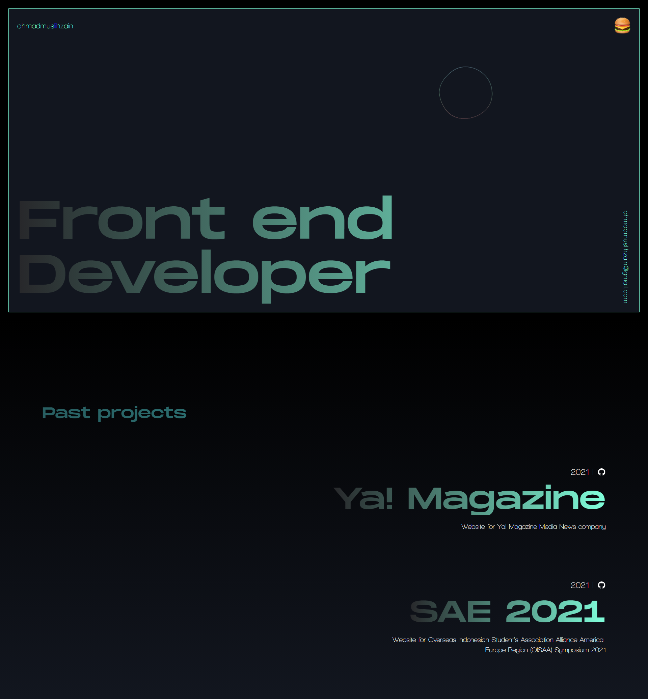

# ahmadmuslih.dev

This is my portfolio website, you can use this for your own portfolio and customize it however you want.

# Screenshot



## Running Locally

```bash
$ git clone https://github.com/aemzayn/ahmadmuslih.dev.git
$ cd ahmadmuslih.dev
$ yarn
$ yarn dev
```

# Built Using

- [Next Js](https://nextjs.org/)
- [Tailwind CSS](https://tailwindcss.com/)
